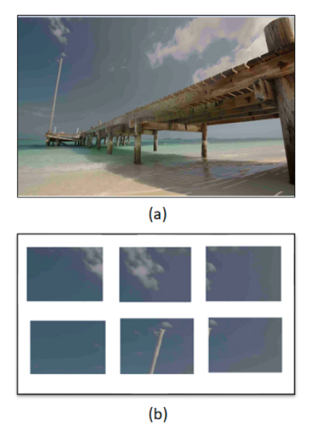

## DBI (Deep Banding Index)

This is the official **Python Tensorflow** implementations of our ICASSP 2020 paper [*"CAPTURING BANDING IN IMAGES: DATABASE CONSTRUCTION AND
OBJECTIVE ASSESSMENT"*](https://ece.uwaterloo.ca/~z70wang/publications/icassp21_banding.pdf).

- [1. Brief Introduction](#1-brief-introduction)
  * [1.1 Backgrounds](#11-backgrounds)
  * [1.2 Contributions](#12-contributions)
  * [1.3 Results](#13-results)
  * [1.4 Citation](#14-citation)
- [2. Dataset](#2-dataset)
  * [2.1 Banding Patches Dataset](#21-tcgafocus)
  * [2.2 HD Images Dataset with Banded and NonBanded Region Information](#22-focuspath-full)
- [3. Prerequest](#3-prerequest)
  * [3.1 Environment](#31-environment)
  * [3.2 Packages](#32-packages)
  * [3.3 Pretrained Models](#33-pretrained-models)
- [4. Python Demo for testing a single image](#4-running-the-code)
- [5. Codes for comparing models](#5-codes-for-comparing-models)
- [6. License](#6-license)

### 1. Brief Introduction
 The [`Deep Banding Index Paper ADD Link`](https://2021.ieeeicassp.org/) introduces [first of its kind dataset: Add links](https://2021.ieeeicassp.org/), [first of its kind dataset: Add links2](https://2021.ieeeicassp.org/) and an Objective Assesment of Banding quantification in HD images with Deep Banding Index, which aims to capture the annoyance caused to end users (QoE) as they percieve media featuring Banding Artifacts.

#### 1.1 Backgrounds
Banding, colour banding, or false contours is a common visual artifact appearing in images and videos, often in large regions of low textures and slow gradients such as sky. When the granularity of bit-depth or display intensity levels mismatches with the visual system’s perception of the smooth transition of color and luminance presented in the image content,the discontinuity positions in smooth image gradients are transformed into perceivable, wide, discrete bands. Banding significantly deteriorates the perceptual quality-of-experience(QoE) of end users. A visual example is shown in the image below where banding artifacts are clearly visible in the sky.
 

 

#### 1.2 Contributions
This work is completed as a research project at University of Waterloo, Under guidance of Dr.Zhou Wang and Jatin Sapra MEng.

#### 1.3 Results
The following results are obtained using the method described in [`Link to paper ADD link`](https://2021.ieeeicassp.org/)
 

#### 1.4 Citation
Please cite our paper if you find our model or the [Banding Patches Dataset](https://doi.org/10.5281/zenodo.4513740), [HD Images Dataset with Banded and NonBanded region Information](https://doi.org/10.5281/zenodo.4513740) dataset useful.

A. Kapoor, J. Sapra and Z. Wang, ["Capturing banding in images: database construction and objective assessment,"](https://ece.uwaterloo.ca/~z70wang/publications/icassp21_banding.pdf) IEEE International Conference on Acoustics, Speech and Signal Processing, Jun. 2021.

### 2. Dataset
- The Dataset is generated by extracting frames from more than 600 pristine high-definition (HD) videos, resulting in approximately 1,250+ images of 19201080 resolution. Banding distortion is be introduced by bit-depth reduction (or dynamic range tone mapping) in luma and chroma channels of image/ video (where bit-depth reduction can also leads to other perceptually visible artifacts). 
- Six levels of quantization are used to enhance the diversity of the dataset, The generation of quantized image frames is explained in [`Data Generation From Pristine Videos`](Dataset-Generation/)

#### 2.1 [HD Images Dataset with Banded and NonBanded region Information](https://zenodo.org/)
  - **Download**: The dataset is available on Zenodo under a Creative Commons Attribution license: .
  - This dataset features 1250+ HD images with their quantized version along with XML files which give information about these regions.
  - refer python scripts [`Patches Generation from HD images`](src/Generating_patches_from_HD_images.py)
  - Also the image below explains the patches generation from HD images 

#### 2.2 [Banding Patches Dataset](https://zenodo.org/record/3926181#.Xv4vg3X0kUd)

   - **Download**: The dataset is available on Zenodo under a Creative Commons Attribution license: 

### 3. Prerequisites

#### 3.1 Environment

The code has been tested on `Ubuntu 18.04` with `Python 3.8` and `tensorflow 2.1`

#### 3.2 Packages

`tensorflow-gpu=2.1`, `statistics`, `pandas`, `pillow` (or `pillow-simd`)

#### 3.3 Pretrained Models

  - Pretrained models could be found in folder `pretrained_model/`

### 4. Running the code

#### 4.1 Python Demo for testing a single image (heatmap available)

Use [predict.py](`src/predict.py`)

### 5. Codes for comparing models

